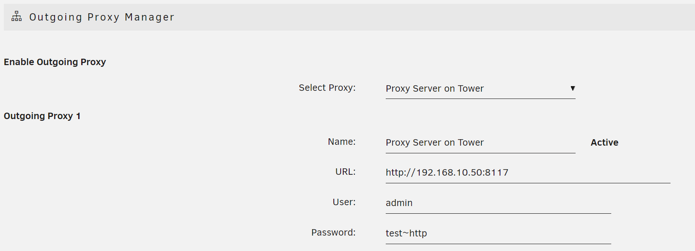

# Outgoing Proxy Manager

The Outgoing Proxy Manager is new to Unraid 7.0. This allows you to proxy Unraid's outgoing http communications through an http proxy to bypass firewall restrictions.
This applies to Unraid itself and not Docker containers or VMs.

:::tip

Depending on your situation, [VPN tunneled access for system](vpn.md#configuring-vpn-tunneled-access-for-system) may be the better option as it will tunnel *all* outgoing traffic from the server.

:::

:::warning

The built-in outgoing/forward proxy is very different from a reverse proxy like NPM. Reverse proxies are not officially recommended or supported, but they are available in Community Applications and discussed in the forums.

:::

## Configuration

Navigate to **Settings → Outgoing Proxy Manager**

Add your proxy name/url and optional user/password and Apply. Then select the proxy you just created from the list and Apply.



The webgui will automatically see the change in proxy. If you have any open webterminal or SSH sessions you will need to close and reopen them for any commands to use the new proxy.

Usage is transparent, the only way you can tell it is being used is by watching the logs on the proxy server.

## Choosing an http proxy server

If your network requires this functionality, use the http proxy server provided by your network administrator.

If you don't already have one, we have tested with the **Proxy Server** Docker container by [@ich777](https://forums.unraid.net/profile/72388-ich777/). You can configure it to run through Unraid's [WireGuard VPN to a commercial provider](vpn.md#outgoing-vpn-connections ) or you can connect it to another Docker container that provides VPN services (instructions in the app description).

:::tip

It is best to host the proxy server on a different system than the one you are proxying, so the network will be available during boot.

:::

To watch the traffic passing through the proxy, navigate to the **Docker tab** of the system that is hosting the proxy, click on the **Proxy Server** container and choose **Logs**.

## Automatic import

If you have the **Proxy Editor** plugin by [@ludoux](https://forums.unraid.net/profile/168579-ludoux/) installed, it will automatically be removed when booting into a release with built-in support for outgoing proxies.  Big thanks to [@ludoux](https://forums.unraid.net/profile/168579-ludoux/) for writing that plugin to simplify things for users until support was added to the OS.

If the config/go script on your flash drive has a line that sets proxies like this:

```bash
http_proxy="someurl" https_proxy="someurl" /usr/local/sbin/emhttp &
```

that will automatically be simplified to:

```bash
/usr/local/sbin/emhttp
```

If you previously added proxy support to Community Applications by creating this file on your flash drive:

```bash
config/plugins/community.applications/proxy.cfg
```

the settings there will automatically be imported and then the file will be renamed.

## Plugins

Plugins using PHP's `curl_init()` function will automatically use this proxy for outgoing connections. Plugins using PHP's `file_get_contents()` function should switch to `curl_init()`. Processes using `wget` would be better off using `curl`.
